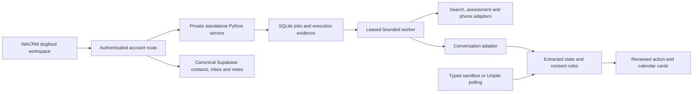

# Chris standalone dogfood

The endeavour-to-WhatsApp introduction product is now at `/chris`. See the
[Chris operations guide](CHRIS-WHATSAPP-PLAN/OPERATIONS.md),
[implementation results](CHRIS-WHATSAPP-PLAN/BUILD-RESULTS.md) and
[acceptance evidence](CHRIS-WHATSAPP-PLAN/ACCEPTANCE-EVIDENCE.md).
The `/dogfood` calendar/simulator workflow below remains available.

Implementation checkpoint: 2026-09-09. The product runs from this WACRM checkout.
It does not import Fleet or require Patrick's OS. The original Fleet reducer,
calendar and amendment rules were extracted with their tests; see
[extraction provenance](CORE-EXTRACTION.md).

## Run locally

The existing local Supabase holds contacts, inbox records, profiles and pipelines.
Do not reset or reseed it. The launcher refuses occupied ports and remote databases.

```powershell
cd C:/wacrm-dogfood
npm ci
python -m venv .local/venv
.local/venv/Scripts/python.exe -m pip install -r concierge_service/requirements-dev.txt
npx supabase start
.local/venv/Scripts/python.exe scripts/local-dogfood.py
```

Open http://127.0.0.1:8316/dogfood. Existing local accounts still work. The launcher
passes local Supabase credentials through child process environments, without
editing an env file. Logs and execution state are under `.local/`.

The default transport, discovery and conversation model are explicitly synthetic.
Type recipient messages in the selected prospect's sandbox. The durable worker
uses the same orchestration/reducer path as normalized provider inbound messages.
No WhatsApp number is needed for this controlled software test. This does **not**
measure real model quality, targeting quality, delivery or customer outcomes.

## Architecture and ownership



Prospects without an established phone remain research candidates, not CRM
contacts with invented identifiers. Promotion uses the authenticated account,
normalized phone and deterministic insert IDs. Existing contacts are reused.
Execution observations, jobs and research evidence live in a local SQLite store;
CRM remains authoritative for customer records. SQLite is a single-host dogfood
implementation decision, not a claim of production multi-host readiness. It avoids
changing protected Supabase migrations or requiring an OS-owned database.

The worker uses transactional job claims, leases, immutable brief/evidence
revisions, bounded retries and per-call cost reservations. Stale results cannot
become current drafts. Unknown charges retain their reserved amount. Provider
errors are reported without dumping credentials or raw exception messages.

## Controlled experiment sequence

1. Enter a real brief when ready: principal, offer, audience, geography, exclusions,
   supported claims, timezone, optional preferred booking link and research budget.
2. Use synthetic discovery to learn the workflow. Configured Treg search returns
   source-backed candidate assertions; it does not establish current employment,
   fit or permission. Assessment cites only supplied records and reports missing
   evidence. Review the result.
3. Phone research returns a separate provider candidate and provenance. Corroborate
   ownership before recording a usable phone; no guessed country codes. Promotion
   and phone ownership never establish permission to contact.
4. Qualify and start a pursuit. Chris identifies itself as an AI assistant and
   drafts an approach. Typed inbound messages trigger another worker turn.
5. Record explicit scope-specific agreement. Introduction, group, scheduling and
   booking are separate scopes for each participant. Exact simulated approvals
   are tied to the current payload, account and evidence revision.
6. Propose times, review a slot and verify the simulated booking. Reschedule and
   cancellation use fresh proposal/recheck/read-back verification. A booking link
   or draft is never an attended meeting.
7. Exercise human takeover, manual simulated reply, resume, STOP, delayed follow-up,
   pause and restart. New replies invalidate incompatible queued work.
8. Record usefulness and customer minutes; export the account report. Synthetic
   results stay labelled and must not be reported as pilot traction.

## Account provider configuration

The service reads explicit account-UUID-keyed JSON maps from the process
environment. The browser never supplies provider credentials. Do not copy keys
into docs, commands saved in shell history, source control or another account.

| Variable | Required account entry |
|---|---|
| `CONCIERGE_MODELS_JSON` | `provider` (`openai` or `anthropic`), `api_key`, explicit `model`, positive `max_cost_usd`; optional `max_tokens` and operator-verified input/output rates per million |
| `CONCIERGE_DISCOVERY_JSON` | `provider: treg`, `token`, positive `max_cost_usd` |
| `CONCIERGE_UNIPILE_JSON` | `base_url`, `api_key`, `account_id` for the dedicated linked WhatsApp account |
| `CONCIERGE_DB_PATH` | Absolute path, required by the service; launcher chooses `.local/dogfood.sqlite3` |
| `CONCIERGE_WORKER_ENABLED` | `1` to process persisted jobs |
| `CONCIERGE_SYNC_INTERVAL_SECONDS` | `0` disables periodic reads; explicit 60–3600 enables bounded polling for configured live accounts |

`scripts/local-dogfood.py` deliberately starts simulation. A live-mode service
requires a separate execution database and explicit server configuration. Changing
a mode never reclassifies synthetic history into live evidence. Readiness reports
configuration, identity verification and live delivery as different facts.

Treg adapters follow the specific deployed catalogue schemas, checked read-only
on 2026-09-09: [people search](https://treg.to/catalog/endpoints/treg.people.search)
and [phone lookup](https://treg.to/catalog/endpoints/treg.people.phone.find).
The generic Treg docs differed from the deployed route envelope; the adapters
validate the actual routed schema and cost metadata. No paid request was made.

The direct OpenAI model adapter uses bounded `max_completion_tokens` and JSON
output, with local shape validation and refusal of truncated/tool responses.
The request fields were checked against the [official Chat Completions reference](https://developers.openai.com/api/reference/python/resources/chat/subresources/completions/methods/create).
Model availability and rates are explicit configuration; no live model acceptance
or guessed pricing is claimed.

## Wabi and Unipile live acceptance

The optional [host composition](../concierge_service/host.py) connects reviewed API
actions to the product-owned live executors. `create_authorized_app` takes an
explicit live `Engine`, private token, a WhatsApp gate, a calendar authorizer and
verified principal provider identities. Gates are absent by default. There is no
environment flag that creates a grant. The WhatsApp gate must check the exact
canonical action and invoke its supplied function only with actual authority;
the calendar authorizer must approve the complete digest-bound provider plan,
including its notification scope. An OS-hosted integration must use its canonical
HR12 authorization. The app shows live approval controls only when the relevant
host callback is installed; installed does not mean an action is authorized.

`Engine(calendars=...)` accepts explicit account-scoped participant bindings.
Each participant entry contains a `GoogleCalendar` client, email, permitted
calendar IDs, timezone and working windows. `GoogleCalendar` obtains OAuth tokens
only through an injected token-provider function and verifies the expected primary
calendar identity. The API can prepare live proposals with those bindings.
`execute_calendar` and `execute_calendar_amendment` require the host authorizer;
the host composition routes reviewed booking and amendment actions to them.
Neither OAuth tokens nor approval integrations have been installed here.

Live WhatsApp and calendar claims commit before provider mutation. A crash or
uncertain response retains a reconciliation state that blocks blind replay.
Read-back verifies account, recipients/event attendees, content/times and exact
provider identity. A visible sent message does not prove recipient delivery.
Sparse Google cancellation receipts remain unresolved rather than fabricating
verification. These paths were tested with fake provider IO, not real recipients.

The selected path is a Wabi number registered as a regular WhatsApp account, then
linked to Unipile. A paid/owned number and working WhatsApp registration have not
been established by this build. The old recycled trial number is not reused.
No Meta Business registration is required by this implementation's chosen pipe.

See [live acceptance record](LIVE-ACCEPTANCE.md) for the controlled test evidence
required before calling the experiment live. Number purchase, OTP/recovery,
account linking and actual sends/invitations were not performed. Live approvals
remain separate from simulation approvals; this build does not arm permission.
New-chat polling validates account, membership, complete pagination, timestamps
and sender identity. Unknown/group/ambiguous chats remain visible for review,
rather than being attached to an invented prospect. Manual outbound causes
takeover. Provider timeouts and partial evidence cannot prove delivery.

## Preserve and inspect the earlier workspace

The original app and `.local/fleet` ledger in `C:/wacrm-product` are untouched.
The standalone service starts a new execution store, while using the same CRM.
The import tool defaults to a read-only inspection:

```powershell
python -m concierge_service.legacy_import --source C:/wacrm-product/.local/fleet --account ACCOUNT_UUID
```

An explicit `--import-workspace --target ABSOLUTE_NEW_DB` copies one simulation
account only into an empty target account. It preserves original observations in
the import archive, maps reducer ownership to the CRM account, preserves permanent
suppression, imports no executable pending actions, and starts paused with a stale
brief pending review. It refuses to overwrite an existing target account.

## Verification

```powershell
.local/venv/Scripts/python.exe -m pytest concierge_service/tests -q
npm test
npm run typecheck
npm run build -- --webpack
.local/venv/Scripts/python.exe scripts/test-local-dogfood.py
```

The HTTP script requires the local standalone launcher. It creates unique retained
local test fixtures and exercises the real authenticated Next route, worker,
Supabase reconciliation, STOP and account separation. It refuses non-loopback
destinations. Verification counts and remaining boundaries are recorded in the
[dated verification report](VERIFICATION-DOGFOOD-2026-09-09.md).
